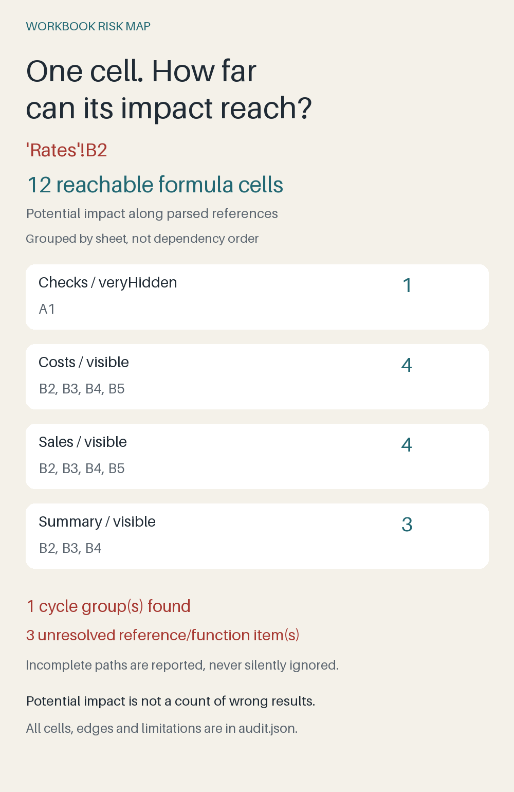

# Workbook Risk Map

Find how far a suspicious spreadsheet cell can reach, including across hidden sheets. Give this Python tool a macro-free `.xlsx` file; it produces a readable impact image and an inspectable dependency graph without requiring Excel.



In the included demonstration, `Rates!B2` contains a broken reference. The audit traces its potential influence to **12 formula cells across four other sheets**, including a very-hidden check sheet. It also identifies a separate circular reference and three unresolved reference/function items. Run the demo to reproduce those results:

```sh
python demo.py --out out-demo
```

`out-demo/report/impact.png` summarizes the issue seed with the most reachable formulas. `audit.json` contains every detected issue, cycle group, parsed dependency and impact set. The generated workbook is an entirely invented regression fixture. No workplace files or customer data are included.

## What the report means

This is **static dependency analysis**, not an Excel calculation engine. A parsed reference creates an edge from the referenced cell to the formula that uses it. Following those edges shows potential downstream reach. An `IF` expression contributes references from both branches, so reach is not proof that a branch executed or a result is wrong.

Stored errors, literal error tokens, cached errors, unsupported formula items and cycle members become inspection seeds. Cached errors may be stale. A workbook with no detected seeds can still contain calculation errors: for example, `=1/0` without a cached result is not evaluated. Missing caches are counted explicitly.

Named ranges, structured tables, external workbooks, 3D references, whole rows/columns, dynamic references such as `INDIRECT` and `OFFSET`, and functions outside the static allowlist are reported as unresolved. Parsed references in those formulas are retained where possible; their impact sets may be incomplete. The tool never follows external links or evaluates macros.

## Why another workbook auditor?

Excel's [Spreadsheet Inquire](https://support.microsoft.com/en-us/excel/analyze-a-workbook-with-spreadsheet-inquire) offers much broader workbook inspection. [FormulaSpy](https://www.formuladesk.com/formulaspy/) provides interactive formula trees, evaluation and precedent drilldown inside Excel.

Workbook Risk Map has a narrower purpose: create a portable static cross-sheet impact report from an XLSX file without an Excel installation. You can inspect the graph as JSON, reproduce the report and see unsupported paths explicitly. It does not replace those tools' formula evaluation or interactive editing.

## Install and use

Requires Python 3.10 or newer. Tested with Python 3.12.14, openpyxl 3.1.5 and Pillow 12.3.0.

```sh
python3 -m venv .venv
# Windows: .venv\Scripts\activate
source .venv/bin/activate
python -m pip install -r requirements.txt
python demo.py --out out-demo
python audit.py path/to/workbook.xlsx --out out-audit
python -m unittest discover -s tests -v
```

Choose a **new output directory** each time. The program refuses to overwrite an existing report. It reads the source workbook without changing it. `READY.json` is written last and records hashes of completed outputs; a failed render removes only its newly created output directory.

The JSON report contains workbook sheet names, cell locations and formula text. Keep reports private when your workbook is private. The program makes no network requests; dependency installation uses the package registry.

## Engineering choices and limits

The dependency graph uses iterative traversal and strongly connected components, so even a cycle longer than Python's recursion limit can be inspected. It records syntactic references rather than attempting partial formula evaluation, trading calculation completeness for a transparent, reproducible graph.

Inspection refuses files above 10 MB compressed, archives above 20 MB expanded or 1,000 members, and individual XML parts above 8 MB. Further limits are 30 sheets, 200,000 cells per used sheet rectangle, 500,000 cells across all used rectangles, 2,000 formulas, 2,000 cells per expanded range, 30,000 edges, 4,000 issue items, 2,000 seeds and 200,000 total reachable entries. These are deliberate bounds for small workbooks, not a service for arbitrarily large uploads.

The image groups the highest-impact seed's reachable formulas by sheet; it is not a dependency-path drawing. Long labels are shortened in the image and retained in full in JSON. No chart series, pivot dependencies, workbook calculation settings, conditional formatting rules or VBA are analyzed. Malformed or encrypted files are unsupported.

Tests cover quoted sheet names, error literals versus text, stale caches, hidden sheets, cycles, unsupported references, size refusal, source preservation and recovery from a failed render.

MIT licensed. See [LICENSE](LICENSE).
